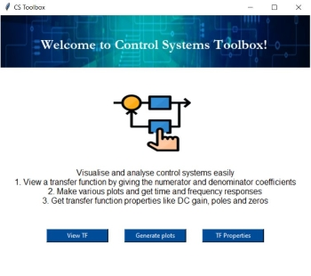
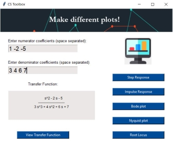

# Control Toolbox
This is a tool box meant for visualising and analysing control systems.
User can get time and frequency response plots and get transfer function properties like poles, zeros etc.

GUI made using Tkinter package in python. PIL library used to handle images.

Control, and matplotlib modules used for analysis and plotting.

Icons used from www.flaticon.com 

## Home Screen

## Plots Screen

