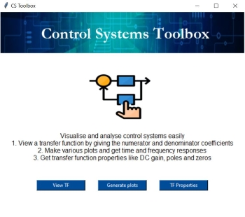
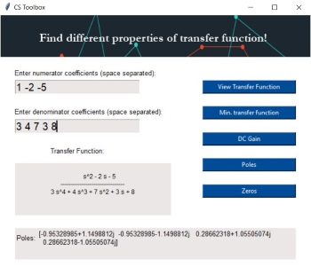

# Control Toolbox
This is a tool-box GUI made using Tkinter package in python meant for visualising and analysing control systems.

User can get time and frequency response plots and get transfer function properties by giving the coefficients of the transfer function as inputs.
Control, and Matplotlib modules are used for analysis and plotting. PIL library is used to handle images.

Icons used from www.flaticon.com 

## Home Screen
The user can select from the three options:
 1. View Transfer Function
 2. Make Plots
 3. Transfer Function Properties

## Plots Screen
By giving space separated coefficients of numerator and denominator of the transfer function, user can get the time and frequency response plots of the system.

For this sample transfer function the following plots can be obtained:

 ####Step Response:

 ####Impulse Response:

 ####Bode Plot:

 ####Nyquist Plot:

 ###Root Locus:

## Transfer Function Properties
By giving space separated coefficients of numerator and denominator of the transfer function, user can get the following for the transfer fucntion:   
 1. Minimum transfer function
 2. DC Gain
 3. Poles
 4. Zeros
 
 
 
To run this toolbox, you should have Tkinter package installed in your system. Download and run the main.py file to start using.

